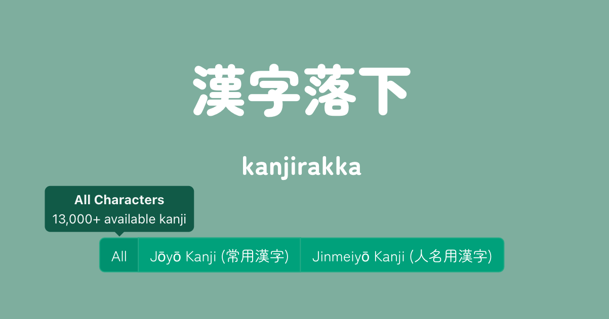

# kanjirakka
'Gravity' typing game using a JSON API for kanji to retrieve different gameplay sets (Jōyō, Jinmeiyō, Kyōiku, by grade or JLPT level).
Type the meaning of a falling kanji before it reaches the screen bottom (or lose a life) and click to save a kanji to user dictionary.

